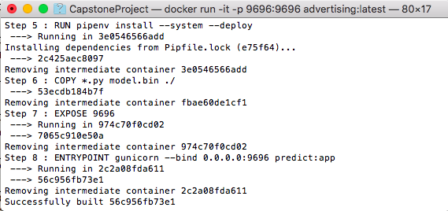
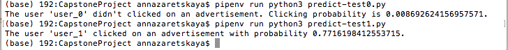

# Advertisement Investigation

This project is a capstone project of the [Machine Learning Zoomcamp](https://github.com/alexeygrigorev/mlbookcamp-code/tree/master/course-zoomcamp) course Cohort 2022.	


## Problem description
In this project we will work with the advertising data of a marketing agency to develop a machine learning algorithm that predicts if a particular user click on an advertisement. 

Prediction of clicking on an advertisement is usefull for: 
- businesses to determine whether an advertising campaign on the internet is successful,
- users to determine whether an advertisement answered their queries.


## Dataset description
We use the Kaggle's [Advertisement - Click on Ad dataset](https://www.kaggle.com/datasets/gabrielsantello/advertisement-click-on-ad). 

The dataset contains 1000 samples and 10 features:
+ 'Daily Time Spent on Site' - user time on site in minutes.
+ 'Age' - user age in years.
+ 'Area Income' - average income of geographical area of a user.
+ 'Daily Internet Usage' - average time in minutes a user spends online per day.
+ 'Ad Topic Line' - the headline of the advertisement.
+ 'City' - the city of a user.
+ 'Male' - whether or not a user is a male.
+ 'Country' - the country of a user.
+ 'Timestamp' - time at which a user clicked on Ad or closed window.
+ 'Clicked on Ad' - 0 or 1 indicated clicking on Ad.

This is a binary classification problem, where we have to predict 'Clicked on Ad' variable which is 1 if a user clicks on an advertisement and 0 if a user didn't click on an advertisement. 


## Project description
For this project we trained the following models: LogisticRegression(), RandomForestClasiifier() and XGBoost(). AUC metric was used as an evaluation score during the model selection process. Data preparation, EDA, parameters tuning and selection of the final model are made in the Jupyter Notebook file [notebook.ipynb](notebook.ipynb). 

The found best model was trained in a Python script [train.py](train.py). This script saved the final model and necessary DictVectorizer object into [model.bin](model.bin) using **pickle**.

Then we added another Python script [predict.py](predict.py) where the final model is loaded and a **Flask** app was created.

For testing our Flask's web service Python scripts [predict-test0.py](predict-test0.py) and [predict-test1.py](predict-test1.py) are used. They send a request with test user data to the Flask's web service and get the prediction. This project has been developed and tested with **Gunicorn** WSGI server.

For creating a virtual environment we use **Pipenv**. Two files with dependencies [Pipfile](Pipfile) and [Pipfile.lock](Pipfile.lock) were created after installation all needed in this project libraries.

Also we added a [Dockerfile](Dockerfile) with the specifications of the **Docker** container.


## Repository structure
- [README.md](README.md): the current file.
- [images](images): folder with images for README.md
- [notebook.ipynb](notebook.ipynb): a Jupyter Notebook with Data preparation, Exploratory Data Analysis, Model selection process and Parameter tuning.
- [advertising.csv](advertising.csv): a CSV file with Advertisement - Click on Ad dataset.
- [train.py](train.py): a Python script for training the final model and saving it to model.bin using pickle.
- [model.bin](model.bin): a bin file with pre-trained final model and DictVectorizer object.
- [predict.py](predict.py): a Python script for loading the model and serving it via a web service using Flask. 
- [predict-test0.py](predict-test0.py) and [predict-test1.py](predict-test1.py): Python scripts for sending a request with test data to the Flask's web service and getting a prediction.
- [Pipfile](Pipfile) and [Pipfile.lock](Pipfile.lock): files with dependencies for creating a virtual environment using Pipenv.
- [Dockerfile](Dockerfile): a Docker file with instructions for the containerizing.


## Virtual environment
Pipenv is used to create a Python virtual environment for this project.

To install Pipenv:
```bash
pip install pipenv
```

1. Clone this GitHub repository and open Terminal in the project folder.

2. Install the dependencies:
```bash
pipenv install
```

3. Activate a Python virtual environment:
```bash
pipenv shell
```


## Model deployment as a web service
4. Train the final model:
```bash
python3 train.py
```

5. For testing the code start up the Flask server:
```bash
python3 predict.py
```

- Or for local deployment start up the WSGI server:
```bash
gunicorn --bind 0.0.0.0:9696 predict:app
```

The server will run on localhost using port 9696 and wait for input the user data.

6. To get the prediction open other Terminal in the project folder and run:

```bash
pipenv run python3 predict-test0.py
```
or 
```bash
pipenv run python3 predict-test1.py
```

As a result you will get the message with sample's prediction:
```
The user 'user_0' didn't clicked on an advertisement. Clicking probability is 0.008692624156957571.
```
or
```
The user 'user_1' clicked on an advertisement with probability 0.7716198412553715.
```

If you want to make predictions on other users, change 'user' variable in [predict-test0.py](predict-test0.py).

7. To stop running the server press CTRL + C.

8. To exit from a pipenv Python virtual environment:
```bash
exit
```

## Building a Docker container
A Dockerfile with specifications for building a Docker image is provided.

To install Docker follow [Docker Engine installation](https://docs.docker.com/engine/install/).

1. To build a Docker image open Terminal in the project folder and run:
```bash
docker build -t advertising .
```


2. To run the Docker image:
```bash
docker run -it -p 9696:9696 advertising:latest
```


3. To test the prediction API running in Docker open other Terminal in the project folder and run:
```bash
pipenv run python3 predict-test0.py
```
or 
```bash
pipenv run python3 predict-test1.py
```

4. To stop running the container press CTRL + C.