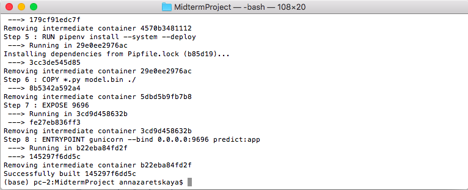
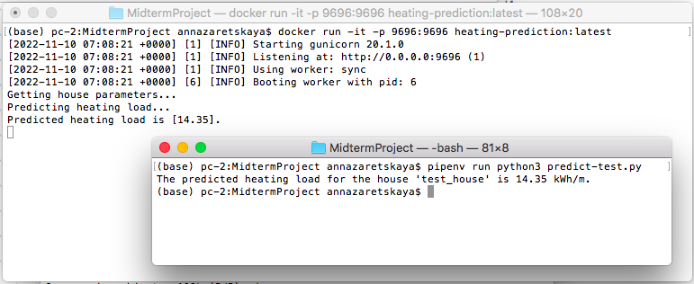

# **Energy Efficiency Analysis**

This project is a midterm project of the [Machine Learning Zoomcamp](https://github.com/alexeygrigorev/mlbookcamp-code/tree/master/course-zoomcamp) course Cohort 2022. 	

## Problem description
In the project we analyze the energy efficiency of buildings by investigating the heating load requirements as a function of building parameters.

It is well known that improving energy efficiency can lower greenhouse gas emissions, decrease water use and, on the other hand, can lower individual utility bills.

Prediction of building energy consumption is usefull for: 
- determination of building's optimal shape at the initial stage of its construction
- determination of the specifications of the heating equipment needed to maintain comfortable indoor air conditions in the later stages of its construction.


## Dataset
We use the [Energy Efficiency Data Set](https://www.kaggle.com/datasets/ujjwalchowdhury/energy-efficiency-data-set) represented by Kaggle.

The dataset comprises 768 samples and 8 features, aiming to predict two real valued responses - `Heating load` and `Cooling load`. For this project we leave only `Heating load` target variable.

The variables are described below. The details can be found in this [article](https://www.researchgate.net/publication/345769875_Towards_Efficient_Building_Designing_Heating_and_Cooling_Load_Prediction_via_Multi-Output_Model).

| Variable | Building Information | Total Values |Data Type | Values |
|:-----|:-----|:-----|:-----|:-----|
| Input | Relative compactness | 12 | float64 | from 0.62 to 0.98 |
| Input | Surface area | 12 | float64 | from 514.5 to 808.5 m2 |
| Input | Wall area | 7 | float64 | from 245 to 416.5 m2 |
| Input | Roof area | 4 | float64 | from 110.25 to 220.5 m2 |
| Input | Overall height | 2 | float64 | 3.5 or 7 m |
| Input | Orientation | 4 | int64 | 2:North, 3:South, 4:East, 5:West |
| Input | Glazing area | 4 | float64 | 0%, 10%, 25%, 40% (of the floor area) |
| Input | Glazing area distribution | 6 | int64 | 0:No glasing, 1:Uniform, 2:North, 3:East, 4:South, 5:West |
| Output | Heating load | 586 | float64 | from 6.01 to 43.10 kWh/m |

## Project description
For this project we trained four models: **Ridge()**, **DecisionTreeRegressor()**, **RandomForestRegressor()** and **XGBoost()**. **RMSE** was used as an evaluation score during the model selection process. Data preparation, EDA, parameters tuning and selection of the final model are made in the Jupyter Notebook file [`notebook.ipynb`](notebook.ipynb). 

The found best model was trained in a Python script [`train.py`](train.py). This script saved the final model and necessary DictVectorizer object into [`model.bin`](model.bin) using **pickle**.

Then we added another Python script [`predict.py`](predict.py) where the final model is loaded and a **Flask** app was created.

For testing our Flask's web service a Python script [`predict-test.py`](predict-test.py) is used. It sends a request with test building data to the Flask's web service and gets the prediction. This project has been developed and tested with **Gunicorn** WSGI server.

For creating a virtual environment we use **Pipenv**. Two files with dependencies [`Pipfile`](Pipfile) and [`Pipfile.lock`](Pipfile.lock) were created after installation all needed in this project libraries.


Also we added a [`Dockerfile`](Dockerfile) with the specifications of the **Docker** container.


### Repository structure
- `README.md`: the current file.

- `images`: folder with images for README.md

- `notebook.ipynb`: a Jupyter Notebook with Data preparation, Exploratory Data Analysis, Model selection process and Parameter tuning.

- `energy_efficiency_data.csv`: a CSV file with Energy Efficiency dataset.

- `train.py`: a Python script for training the final model and saving it to model.bin using pickle.

- `model.bin`: a bin file with pre-trained final model and DictVectorizer object.

- `predict.py`: a Python script for loading the model and serving it via a web service using Flask. 

- `predict-test.py`: a Python script for sending a request with test data to the Flask's web service and getting a prediction.

- `Pipfile` and `Pipfile.lock`: files with dependencies for creating a virtual environment using Pipenv.

- `Dockerfile`: a Docker file with instructions for the containerizing.

## Dependency and enviroment management

Pipenv is used to create a Python virtual environment for this project.

To install Pipenv:
```bash
pip install pipenv
```

1. Clone this GitHub repository and open Terminal in the project folder.

2. Install the dependencies:
```bash
pipenv install
```

3. Activate a Python virtual environment:
```bash
pipenv shell
```


## Run the model locally with Flask

4. Train the final model:
```bash
python3 train.py
```

5. For testing the code start up the Flask server:
```bash
python3 predict.py
```

- Or for local deployment start up the WSGI server:
```bash
gunicorn --bind 0.0.0.0:9696 predict:app
```

The server will run on localhost using port 9696 and wait for input the house data.

6. To get the prediction open other Terminal in the project folder and run:

```bash
pipenv run python3 predict-test.py
```
As a result you will get the message with sample's prediction:
```
The predicted heating load for the house 'test_house' is 14.35 kWh/m.
```

If you want to make predictions on other houses, change 'house' variable in [predict-test.py](predict-test.py).

7. To stop running the server press CTRL + C.

8. To exit from a pipenv Python virtual environment:
```bash
exit
```

## Build a Docker container 
A Dockerfile with specifications for building a Docker image is provided.

To install Docker follow [Docker Engine installation](https://docs.docker.com/engine/install/).

1. To build a Docker image open Terminal in the project folder and run:
```bash
docker build -t heating-prediction .
```


2. To run the Docker image:
```bash
docker run -it -p 9696:9696 heating-prediction:latest
```


3. To test the prediction API running in Docker open other Terminal in the project folder and run:
```bash
pipenv run python3 predict-test.py
```

4. To stop running the container press CTRL + C.